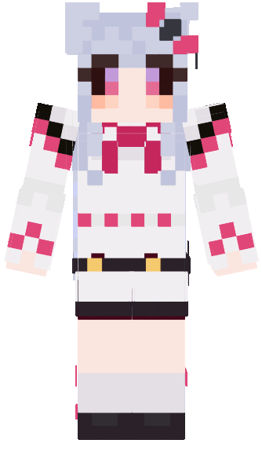
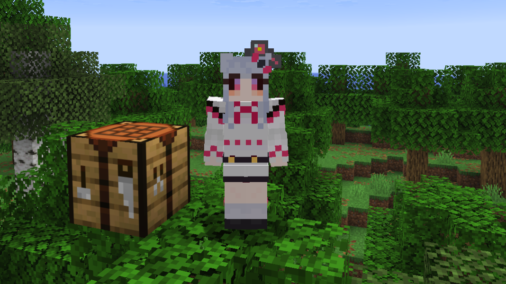

# skin.Lulunya_Apatia

## 概要
YouTubeなどで活動されているルルーニャ・アパティア/Lulunya Apatia様をモデルにしたファンメイドコンテンツです。

頭装備アリ/Helmet Equipped

## 対応環境
Minecraft Java Edition Ver.26.2

## 利用について

本配布物は、ルルーニャ・アパティア様をモデルとして制作したMinecraft Java Edition向けのファンメイドコンテンツです。

### 許可

* Minecraftでの個人利用
* スクリーンショットの撮影・SNSへの投稿
* 本データを使用した動画・配信への利用
* 個人利用の範囲でのデータの改変

### 禁止

* 本配布物またはその一部の再配布
* 改変したデータの再配布
* 自作発言
* 本配布物そのもの、または本配布物を主たる商品とする販売・有償配布
* 元となった人物・キャラクターの権利を侵害する用途での使用

本配布物は非公式のファンメイドコンテンツです。
Minecraft、Mojang Studios、Microsoft、および元となった人物・関係者による公式コンテンツではありません。

本配布物の利用によって生じた問題について、制作者は責任を負いかねます。

--------

## Overview

Fan-made Minecraft content based on Lulunya Apatia, a VTuber.

## Requirements

Minecraft: Java Edition 26.2

## Terms of Use

This package is fan-made content for Minecraft: Java Edition, created based on the character design of Lulunya Apatia.

### Permitted Uses

* Personal use in Minecraft
* Taking screenshots and sharing them on social media
* Use in videos and livestreams
* Modification of the files for personal use

### Prohibited Uses

* Redistributing this package or any part of it
* Redistributing modified versions of the files
* Claiming this content as your own work
* Selling this package, distributing it for a fee, or selling products in which this package constitutes the primary content
* Any use that infringes upon the rights of the person or character on which this content is based

This package is unofficial fan-made content.
It is not official content produced by Minecraft, Mojang Studios, Microsoft, Lulunya Apatia, or any related parties.

The creator assumes no responsibility for any issues or damages arising from the use of this package.
